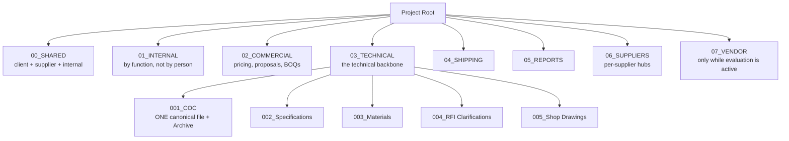

# Starting OneDrive Project Folder Structure

A generic, reusable folder structure for a new project's live OneDrive workspace — the shared-drive counterpart to this git repo. Copy this shape when a new project starts; adapt folder names to the project's actual workstreams, but keep the numbering-by-function discipline described below.

## Why function, not person

Organize top-level folders **by function/workstream**, never by team member's name. A by-person layout (e.g. a folder per coordinator) only works for whoever built it — it doesn't transfer when someone new joins, and it actively works against the goal of a project coordinator being able to open the drive cold and find things. If a person needs their own working space, give them a subfolder inside the relevant functional folder, not a top-level folder of their own.

## Starting structure

```
<PROJECT>/
├── 00_SHARED/        — cross-functional trackers used by client, supplier, and internal team alike
│   ├── General/
│   ├── Project Scope/
│   ├── Project Schedule/
│   ├── RFI/
│   └── Specifications, Materials, Shop Drawings, etc. — one subfolder per shared tracker type
│
├── 01_INTERNAL/      — internal-only planning, staffing notes, working drafts
│   └── organize BY FUNCTION (e.g. Scheduling/, Sourcing/, Drafting/) — not by person
│
├── 02_COMMERCIAL/    — pricing, proposals, RFQs, BOQs, awarded packages
│   ├── BOQ/
│   ├── Pricing Comparison/
│   ├── Project Awarded/
│   └── Proposals/(From_Supplier / To_Supplier)/
│
├── 03_TECHNICAL/     — the technical backbone
│   ├── 001_COC/                              — one canonical Control Centre workbook, plus Archive/
│   ├── 002_Specifications/
│   ├── 003_Materials/
│   ├── 004_RFI Clarifications/
│   ├── 005_Shop Drawings/
│   └── 00N_Project Scope/
│
├── 04_SHIPPING/
├── 05_REPORTS/
├── 06_SUPPLIERS/     — per-supplier collaboration hubs
└── 07_<VENDOR>/      — one folder per named alternate/prospective vendor being evaluated, only while active
```



## Orientation files (place at the project root, not in git)

Two files live at the root of the live OneDrive folder itself — not in this git repo, since they carry real names/numbers this repo's redaction rule doesn't allow:

- **`_<PROJECT>_Folder_Guide.md`** — narrative orientation: what the project is, who the real people are, what's where, current known issues. Leading underscore sorts it to the top of the folder listing so it's the first thing anyone sees.
- **`_<PROJECT>_File_Index.xlsx`** — a flat, sortable index of every file (path, type, size, modified date, and an Umbrella-Task-equivalent tag), generated by walking the folder tree. Regenerate this periodically (weekly is reasonable) rather than hand-maintaining it — see "Keeping it current" below.

## Naming conventions (lessons learned the hard way)

- **Dates are `YYMMDD`, always, no exceptions.** A single digit-transposition (`261507` vs `261705`) creates a folder that looks intentional but is actually an empty duplicate — this happened independently in multiple unrelated folders on one real project, purely from date-format slips. If a tool auto-generates a folder name, verify the date came out right before trusting it.
- **Don't duplicate reference files across multiple recipient folders.** If the same drawing set or data log needs to go to five different RFQ recipients, link/reference it once rather than copying it five times — copies drift out of sync and bloat the drive for no benefit. One real project accumulated ~1GB this way.
- **Don't rename a file to make it look updated unless the content actually changed.** An English-retitled "updated" file that's byte-identical to an older original creates false confidence that a review happened.
- **Watch for copy-paste template leftovers** — a title block or header carrying the wrong item name/date is a common artifact of cloning one spec sheet or tracker row into a new one without updating every field.
- **Structured status fields need to actually get used**, not just exist. A tracker where every item sits at "To Be Submitted" for months while real progress happens only in a free-text remarks column looks stalled even when it isn't — and *is* stalled if no one's watching the remarks column.
- **A single canonical file per document type.** If a Control Centre, schedule, or scope document exists in more than one place at once (an internal working copy, a shared-drive copy, a git-tracked copy), decide which one is authoritative before more than one starts drifting — don't let "the COC" quietly become three different files.

## Keeping it current

Whatever assistant or process maintains this structure should re-scan on a deliberate cadence — not continuously, and not folded into unrelated daily routines. A useful pattern: an explicit, on-demand check command (not automatic) that (a) diffs the current folder against the last-generated file index to find what's new or changed, (b) actually reads/audits the new or changed material for the naming/quality issues above rather than just re-reading everything every time, (c) refreshes the orientation files, and (d) hands back a findings list for a human to triage — the assistant should surface problems, not silently decide what to do about them.
